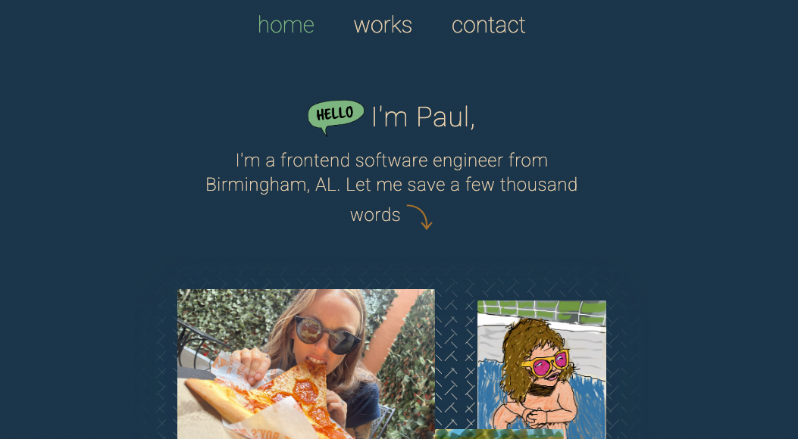

# Portfolio

### Preview:

### Things I learned:
  - Svelte routing
  - Using `<slot/>` in Svelte to persist across routes
  - Svelte's `{#each ___ as __}` loop and `{#if}` conditional rendering setup
  - How to build a custom image carousel from scratch
  - The `+layout.svelte` and `+page.svelte` system
  - Deploying a Svelte app with `Netlify`
  - What it takes to convert even a small site to another framework 
  - How to show deployment status 
  
---

  

---

### Challenges I faced while building this:
  1. Svelte is a good bit different when you've only used React
  2. Building that carousel
  3. Creating a modal from scratch
  4. Handling all the `A11y` errors/warnings to maximize accessability
  5. Getting the nav links to color switch properly using the `$page` object

---

### Tech I used:

 

---

### Things I'm proud of:
  - It only took me one real day of working to complete this
  - Tailwind is like second nature already
  - I'm crazy proud of that carousel on the `/works` page
  - Catching on to a new framework so easily and quickly made me feel like maybe I understand this coding stuff more than I give myself credit for
  - The color scheme is good on the original and the clone while remaining unique to themselves